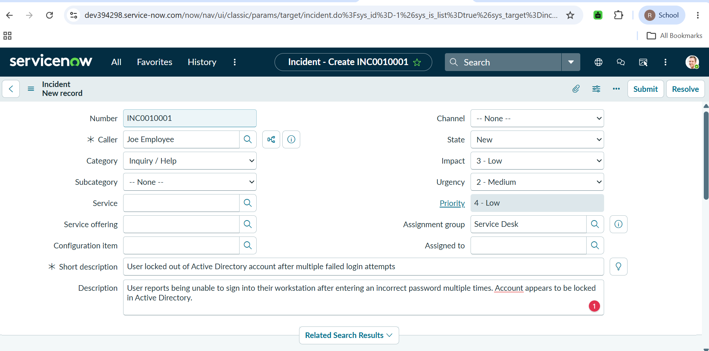
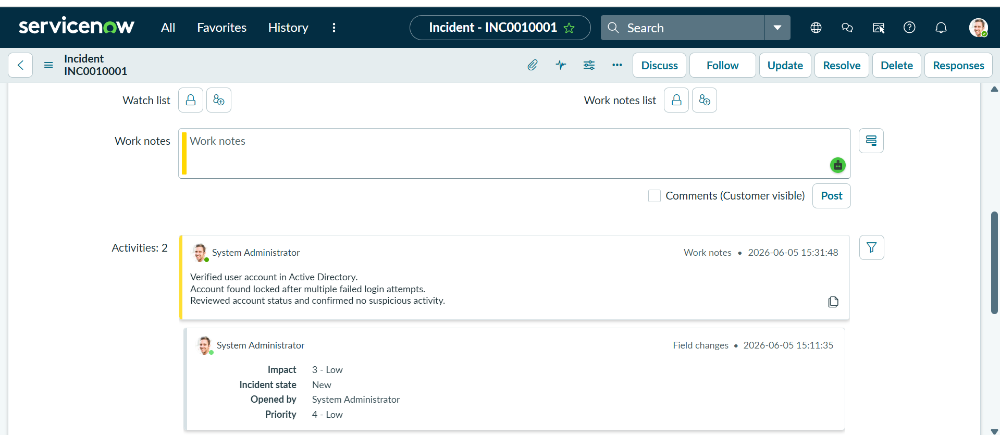
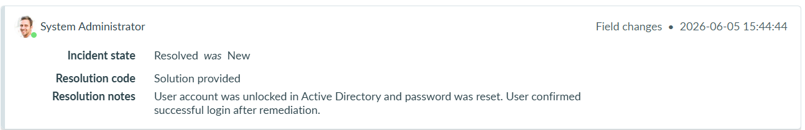
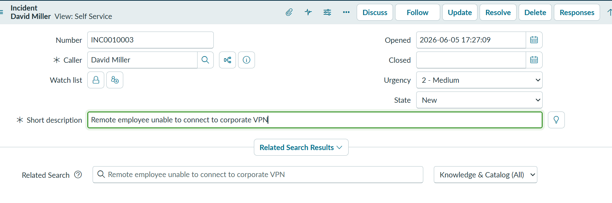
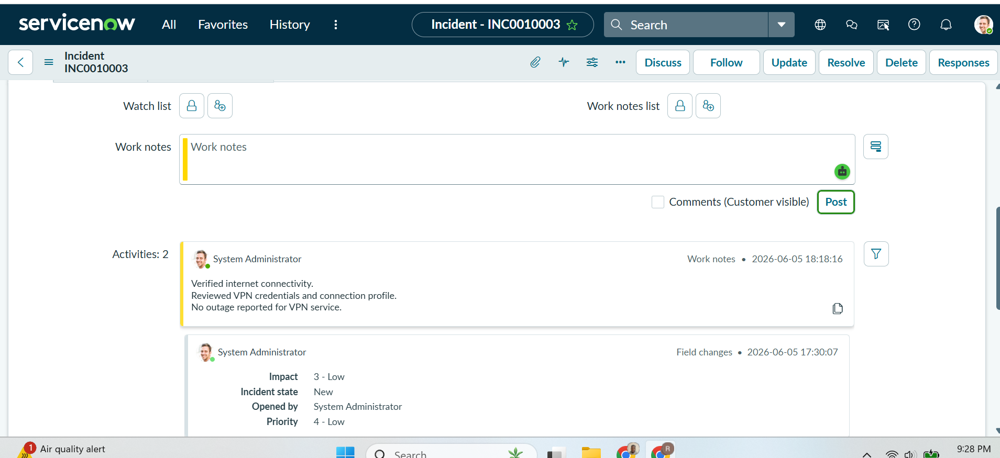
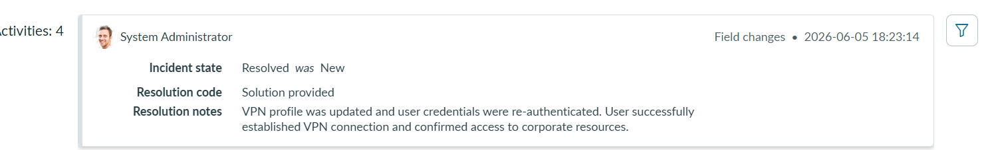

# ServiceNow Incident Management Lab

## Overview

This hands-on ServiceNow lab demonstrates the incident management lifecycle, including:

- Incident creation
- Ticket documentation
- Troubleshooting and investigation
- Work note updates
- Resolution documentation
- Incident closure

The objective of this project was to simulate common IT Service Desk scenarios and document the workflow used to resolve user issues.

---

# Incident 1: Active Directory Account Lockout

## Scenario

A user was unable to log into their workstation after multiple failed login attempts.

## Investigation

- Verified user account in Active Directory
- Confirmed account lockout status
- Reviewed login activity
- Confirmed no suspicious activity

## Resolution

- Unlocked the user account
- Reset user password
- Verified successful login
- Updated ticket documentation
- Resolved and closed incident

### Screenshots

---

# Incident 2: VPN Connectivity Issue

## Scenario

A remote employee reported being unable to connect to the corporate VPN while working remotely.

## Investigation

- Verified internet connectivity
- Reviewed VPN profile configuration
- Confirmed VPN service availability
- Checked authentication settings

## Resolution

- Updated VPN profile configuration
- Re-authenticated user credentials
- Verified successful VPN connection
- Confirmed access to corporate resources
- Updated documentation and resolved ticket

### Screenshots

---

# Skills Demonstrated

- ServiceNow Incident Management
- Ticket Documentation
- IT Service Desk Operations
- Active Directory Troubleshooting
- VPN Troubleshooting
- Incident Resolution Workflow
- Root Cause Analysis
- Technical Documentation
- ITIL Incident Management Concepts

---

# Challenges Encountered

During the lab, different ServiceNow views were encountered, including the Self-Service and Standard Incident views. Learning how to navigate between views, locate incident records, document work notes, and properly resolve tickets provided valuable experience with ServiceNow's interface and workflow management.

---

# Tools Used

- ServiceNow Developer Instance
- Active Directory (Simulated)
- Incident Management Module
- Web Browser
